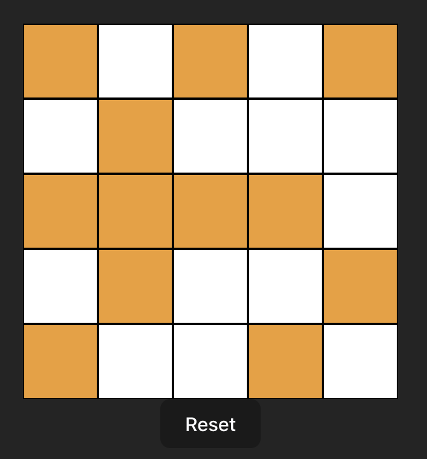

## Get familiar using ReactTS by building lights on game

A puzzle game built with ReactTS where the goal is to turn off all the lights on a 5x5 board.

### Project Initialisation

Create a new Vite app in an `exercise` folder by running `npm create vite@latest`.

- select `React` as the framework
- select `Typescript` as the variant

You are free to choose your own project name.

### Demo

https://youtu.be/reC6WGxuXIM

### Game Functionality

1. The game starts with a randomized 5x5 grid of lights, each either on or off.
2. Clicking a light toggles its state along with the adjacent lights (above, below, left, and right).
3. The objective is to turn off all the lights on the board.
4. Tracks the number of moves made by the player.
5. Displays a winning message when all lights are turned on.

### Bonus Features

1. Includes a reset button to generate a new randomized board.
2. Highlights the winning condition when all lights are on.

### _Note: Some board configurations may be unsolvable._
