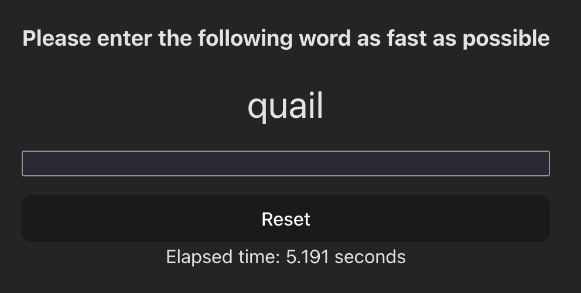

## Get familiar using ReactTS by building reflex game

A simple reflex-based game built with ReactTS. The game tests how quickly users can type a randomly selected vocabulary word.

### Project Initialisation

Create a new Vite app in an `exercise` folder by running `npm create vite@latest`.

- select `React` as the framework
- select `Typescript` as the variant

You are free to choose your own project name.

### Demo

https://youtu.be/RrwBu-VNrsA

### Game Functionality

Build a reflex game with ReactTS that has the following functionality

1. The game starts automatically when the page loads.
2. A random word is selected from a predefined vocabulary list.
3. Once the game begins, a timer starts tracking the player’s speed.
4. The player must type the correct word into the input field.
5. The game ends as soon as the correct word is entered.
6. The game logs the final result for tracking performance.

### Bonus Features

1. Clears the input field if the player enters an incorrect word.
2. Includes a reset button to restart the game.
