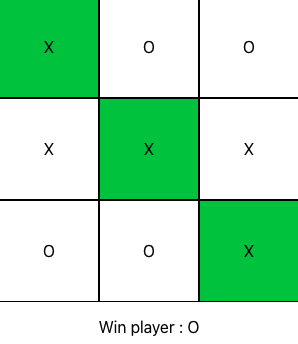

## Get familiar using ReactTS by building a tic-tac-toe game

Build a tic-tac-toe game with ReactTS that has the following functionality

**Game functionality**

1. Players can click on cells, filling them with X or O depending on whose turn it is.
2. Define a win condition for players
3. In case of a win:
   - Display the winning player’s name
   - Set the colour of winning cells to green (using CSS in TS)
   - Increase respective player’s win count in local storage

As a bonus exercise you may want to explore:

- Using loops as part of rendering
- Ensure that a cell can only be clicked once

## Project Initialisation

Create a new Vite app in an `exercise` folder by running `npm create vite@latest`.

- select `React` as the framework
- select `Typescript` as the variant

You are free to choose your own project name.
