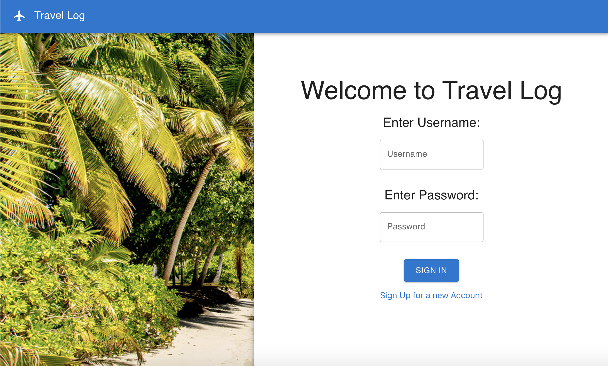

## Get comfortable using a UI framework by using one to build a page

Using only components from the [Material UI](https://mui.com/material-ui/getting-started/) library try and recreate the following website layout:



- Install the material UI library using the following commands

```sh
npm install @mui/material @emotion/react @emotion/styled
npm install @mui/icons-material @mui/material @emotion/styled @emotion/react
```

- Use material UI components such as AppBar, Box, Paper, Typography, Link and Button to develop your own version of this page.
- For the beach image use the `beach.jpeg` file given in the src folder
- For the plane icon, use the icon available in the Material UI Icon library
- When the _Sign In_ button is clicked console log the message "Welcome to Travelog {username}!"
- If either username or password as empty when _Sign In_ button is pressed, console log the message "Enter username and password"

## Project Initialisation

Create a new Vite app in an `exercise` folder by running `npm create vite@latest`.

- select `React` as the framework
- select `Typescript` as the variant

You are free to choose your own project name.
